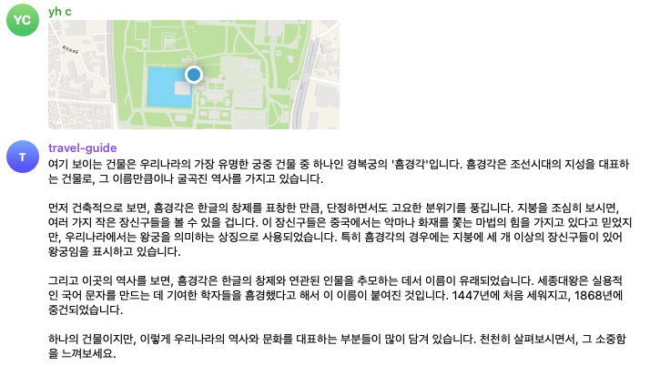
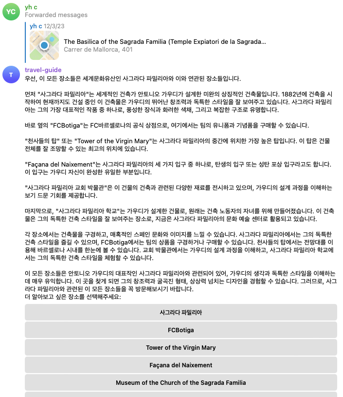
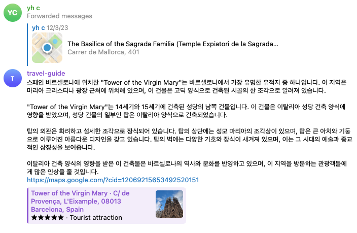
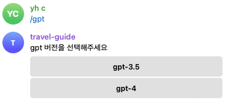
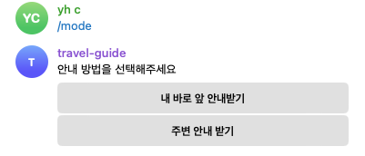

<p align="center">
    <h1 align="center">TRAVEL-GUIDE</h1>
</p>
<p align="center">
    <em>Discover the world with your personal guide!</em>
</p>
<p align="center">
	
	
	
	
<p>
<p align="center">
</p>
<hr>

##  Quick Links

> - [ Overview](#-overview)
> - [ How to use](#-how-to-use)
> - [ Repository Structure](#-repository-structure)
> - [ Modules](#-modules)
> - [ Getting Started](#-getting-started)
>   - [ Running travel-guide](#-running-travel-guide)
> - [ License](#-license)

---

##  Overview

While traveling, we often come across interesting sights right in front of us, but identifying them can be a challenge. Sure, we could use Google Maps and search Wikipedia, but who wants to be glued to a screen while exploring? That's where the Travel-Guide project comes in handy. It addresses this issue by simply reading your location and providing insights into what's right in front of you (within a range of 10m to 200m), offering perspectives on historical, cultural, architectural, and geological aspects.

The bot leverages the Google Places API and OpenAI API, offering two modes of guidance: 'Guide Right Infront' and 'Guide Nearby Places.' In 'Guide Right Infront' mode, the bot provides detailed descriptions of cultural and historical sites, complete with interesting stories or legends. Switching to 'Guide Nearby Places' mode displays a list of nearby places, allowing users to select a specific location for a comprehensive guide along with a Google Maps URL for easy navigation. The bot also supports choosing different versions of the GPT language model for generating the guide.

Originally envisioned as a voice-reading audio guide app, the project currently stopped in the MVP stage using a Telegram bot. Because none of my friends showed interest in using it. However I found it functional and practical during my own use.

---

##  How to use


### Guide what's right infront of me
Select "guide right infront" and send your location in the telgram app


### Guide the area briefly
Select "guide area" and send your location in the telgram app



Choose the place you want to visit than you will get detailed guide and google maps link.



### Set a gpt version


### Set a guide type



---

##  Repository Structure

```sh
└── travel-guide/
    ├── Dockerfile
    ├── bot.py
    ├── core
    │   ├── gpt.py
    │   └── places.py
    └── requirements.txt
```

---

##  Modules

<details closed><summary>.</summary>

| File                                                                                      | Summary                                                                                                                                                                                                                                                                                                                                                                                                                                                                                      |
| ---                                                                                       | ---                                                                                                                                                                                                                                                                                                                                                                                                                                                                                          |
| [bot.py](https://github.com/younghch/travel-guide/blob/master/bot.py)                     | The `bot.py` file powers a location-based Telegram bot. The bot provides interactive travel guide services to users, suggesting nearby places and giving detailed guides based on user's location data. It offers options to choose the guide mode (places right infront or nearby places) and the generation model version (GPT-3.5 or GPT-4) for customized responses. It utilizes core functionalities defined in other modules for place recommendations and generation of guided texts. |

</details>

<details closed><summary>core</summary>

| File                                                                             | Summary                                                                                                                                                                                                                                                                                                                                                                                                                                                                                                                   |
| ---                                                                              | ---                                                                                                                                                                                                                                                                                                                                                                                                                                                                                                                       |
| [places.py](https://github.com/younghch/travel-guide/blob/master/core/places.py) | The code in core/places.py serves as a critical component for the travel-guide bot. It uses Google Places API to fetch details of popular or historical points of interest near a user-provided location. It defines a list of tourist and historical place types, creates and sends a query to Google via a POST request, and retrieves place names and addresses in response. This module significantly contributes to the bot's ability to recommend travel destinations.                                              |
| [gpt.py](https://github.com/younghch/travel-guide/blob/master/core/gpt.py)       | The core/gpt.py module is an integral part of the travel-guide repository. Its key functions are to generate content for a travel guide application by leveraging the capabilities of the GPT-3 and GPT-4 models from OpenAI. The code creates guided tours in Korean, presenting detailed narratives about various places. It has two different narration-types: a general overview of multiple places and a detailed guide for a specific location. The module utilizes structured prompts to guide the AI's responses. |

</details>

---

##  Getting Started

***Requirements***

- Register a telegram bot and get api key
- Create GCP project and get places api key
- Get OpenAI API key

###  Running travel-guide

1. Clone the travel-guide repository:

```sh
git clone https://github.com/younghch/travel-guide
```

2. Change to the project directory:

```sh
cd travel-guide
```

3. Run server using docker:

```sh
docker build . -t travel-guide:v1
docker run  --name travel-guide \
    -e GCP_PLACES_API_KEY=YOUR_GCP_API_KEY \
    -e TELEGRAM_API_KEY=YOUR_TELEGRAM_API_KEY \
    -e OPENAI_API_KEY=YOUR_OPENAI_API_KEY \
    -e ALLOWED_USER_NAME=ALLOWED_TELEGRAM_USER_NAME \
    -d \
    travel-guide:v1
```

Or export the environment variable in the shell and run python code directly:
```sh
python main.py
```

---

##  License

[MIT](./LICENSE)

[**Return**](#-quick-links)

---
